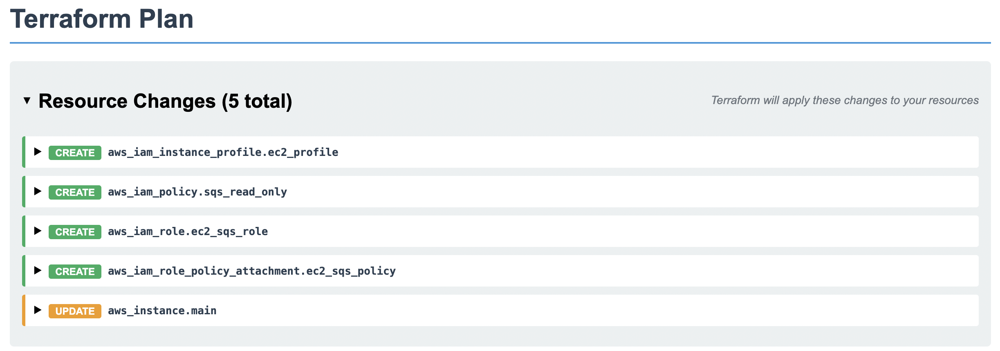

# Terraform Plan Visualizer

A free, open source Terraform plan visualization tool that converts Terraform plan JSON files into succinct, interactive HTML pages. Perfect for sharing plan results in CI/CD pipelines, pull requests, and team collaboration.



## Quick Start

### Using the Binary

1. **Download the latest release** from the [Releases page](https://github.com/cloudvic-org/terraform-plan-visualizer/releases)

2. **Generate a Terraform plan JSON file**:
   ```bash
   terraform plan -out=plan.tfplan
   terraform show -json plan.tfplan > plan.json
   ```

3. **Generate the visualization**:
   ```bash
   ./terraform-plan-visualizer -i plan.json -o visualization.html
   ```

4. **Open the HTML file** in your browser to view the interactive visualization

### Using Docker

```bash
# Generate plan JSON (as above)
terraform plan -out=plan.tfplan
terraform show -json plan.tfplan > plan.json

# Run with Docker
docker run --rm -v $(pwd):/workspace \
  cloudvic-org/terraform-plan-visualizer:latest \
  -i /workspace/plan.json -o /workspace/visualization.html
```

### Using GitHub Action

```yaml
name: Terraform Plan Visualization
on:
  pull_request:
    paths:
      - 'terraform/**'

jobs:
  plan:
    runs-on: ubuntu-latest
    steps:
      - uses: actions/checkout@v4
      
      - name: Setup Terraform
        uses: hashicorp/setup-terraform@v3
        with:
          terraform_version: 1.6.0
      
      - name: Terraform Plan
        run: |
          cd terraform
          terraform init
          terraform plan -out=plan.tfplan
          terraform show -json plan.tfplan > plan.json
      
      - name: Generate Visualization
        uses: cloudvic-org/terraform-plan-visualizer@v1
        with:
          plan-file: terraform/plan.json
          output-file: terraform-visualization.html
      
      - name: Upload Visualization
        uses: actions/upload-artifact@v4
        with:
          name: terraform-plan-visualization
          path: terraform-visualization.html
```

## Installation

### From Source

```bash
git clone https://github.com/cloudvic-org/terraform-plan-visualizer.git
cd terraform-plan-visualizer
go build -o terraform-plan-visualizer .
```

### Using Go Install

```bash
go install github.com/cloudvic-org/terraform-plan-visualizer@latest
```

## Usage

### Command Line Options

```bash
terraform-plan-visualizer [OPTIONS]

Options:
  -i, -input string        Input Terraform plan JSON file (required)
  -o, -output string       Output HTML file path (default: index.html)
  --output-html-path string
                           Output HTML file path (alternative to -o)
  -h, -help               Show help information
  -v, -version            Show version information
```

### Examples

```bash
# Basic usage
terraform-plan-visualizer -i plan.json

# Custom output file
terraform-plan-visualizer -i plan.json -o my-plan.html

# Using long-form flags
terraform-plan-visualizer --input plan.json --output-html-path visualization.html
```

## Integration Examples

### GitHub Actions

```yaml
- name: Generate Plan Visualization
  uses: cloudvic-org/terraform-plan-visualizer@v1
  with:
    plan-file: terraform/plan.json
    output-file: plan-visualization.html
    upload-artifact: true
```

### GitLab CI

```yaml
generate_visualization:
  image: ghcr.io/cloudvic-org/terraform-plan-visualizer:latest
  script:
    - terraform-plan-visualizer -i plan.json -o visualization.html
  artifacts:
    paths:
      - visualization.html
```

### Jenkins

```groovy
pipeline {
  agent any
  stages {
    stage('Visualize Plan') {
      steps {
        sh 'terraform-plan-visualizer -i plan.json -o visualization.html'
        archiveArtifacts artifacts: 'visualization.html'
      }
    }
  }
}
```

## License

This project is licensed under the MIT License - see the [LICENSE](LICENSE) file for details.

## Related Projects

- [CloudVIC](https://cloudvic.com) - Advanced Terraform plan and state visualizations, with drift detection, git history integration, and more
